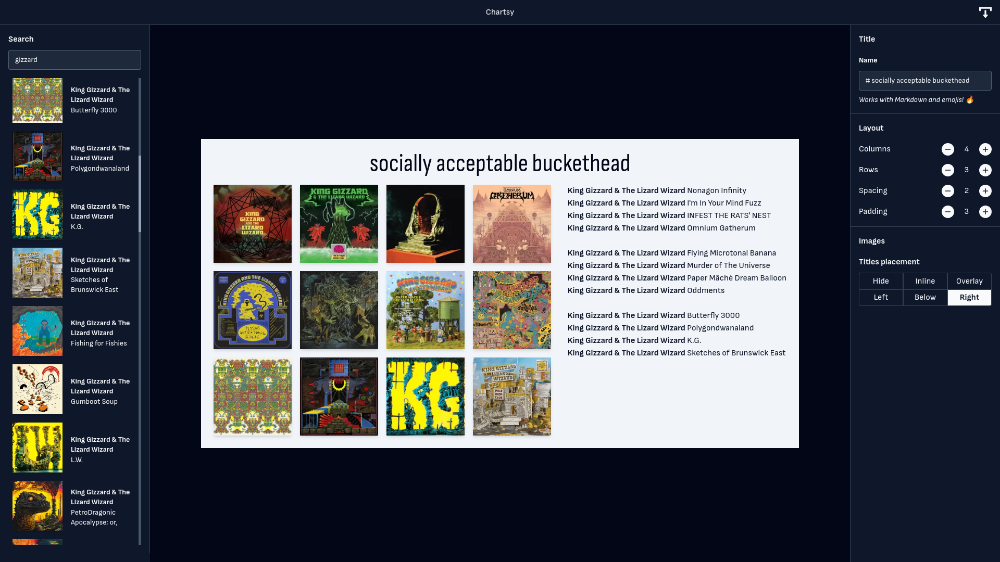

# Chartsy



Chartsy is a modern site for building charts of music, video games, movies, and TV series. It's built with React on the frontend, and there's two backend implementations, in Python with Flask, and Go with Chi.

## Build

You need yarn and Go >= 1.15 installed (and optionally Python) installed, then you start up the frontend with

```console
yarn run start
```

This runs the app in the development mode. Open [http://localhost:3000](http://localhost:3000) to view it in the browser.
The page will reload if you make edits. You will also see any lint errors in the console.

Then, you can start up with backend with

```console
cd apigo
go build
LASTFM_KEY=<your key here> ./chartsy
```

You'll need a last.fm account and an API key to be able to run the app.
