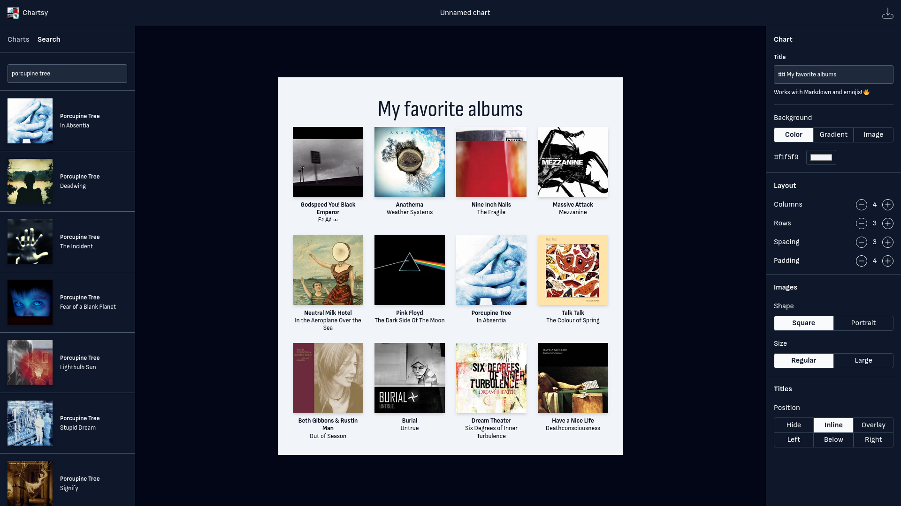

# Chartsy



Chartsy is a modern web app for building music charts. It's built with NextJS, TailwindCSS, and more.

## Build

You need npm, then you start up with

```console
npm install
npm run dev
```

This runs the app in development mode. Open [http://localhost:3000](http://localhost:3000) to view it in the browser.
The page will reload if you make edits. You will also see any lint errors in the console.

